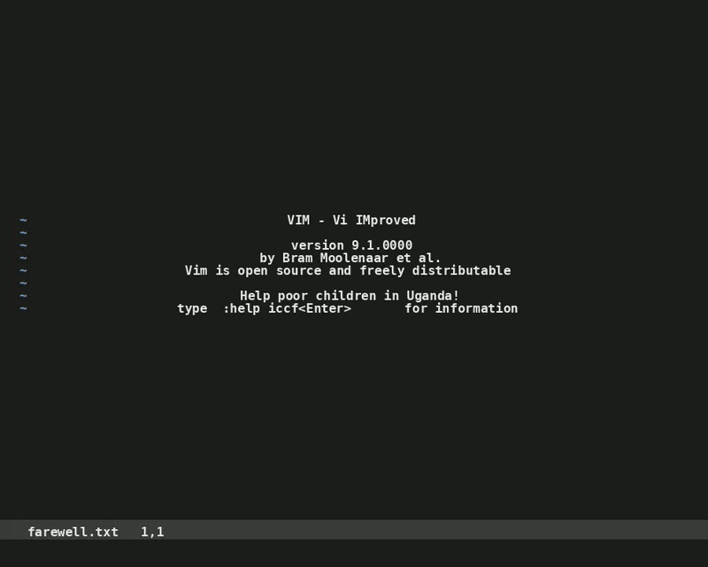

# vim2vid

Generate realistic VIM typing videos from text files. Perfect for social media content.



## Installation

### Option 1: Docker (Recommended)
No installation needed! Use the pre-built Docker image:

```bash
# Create a text file and generate video in one command
echo "Hello from vim2vid!" > yourtext.txt
docker run --rm -v $(pwd):/folder ghcr.io/guybrush1984/vim2vid:latest /folder/yourtext.txt /folder/yourtext.mp4
```

### Option 2: Local Installation
```bash
pip install -e .
```

## Usage

### Docker Usage
```bash
# Quick start - create text and generate video
echo "Your content here" > input.txt
docker run --rm -v $(pwd):/workspace ghcr.io/guybrush1984/vim2vid:latest /workspace/input.txt /workspace/output.mp4

# With custom config
docker run --rm -v $(pwd):/workspace ghcr.io/guybrush1984/vim2vid:latest /workspace/input.txt /workspace/output.mp4 --config /workspace/examples/config_example.json

# Show help and version
docker run --rm ghcr.io/guybrush1984/vim2vid:latest --help
```

### Local Usage  
```bash
# Basic usage (uses default.json)
vim2vid input.txt output.mp4

# With custom config
vim2vid input.txt output.mp4 --config my_config.json
```

## Configuration

All settings are in JSON files. Create custom configs by copying and editing the provided examples:

```json
{
  "width": 1280,
  "height": 720,
  "font_size": 18,
  "typing_speed_base": 0.05,
  "highlight_patterns": ["TODO", "important"],
  "special_sequences": {
    "GPT-4": ["GPT-3", "GPT-4"]
  }
}
```

**Provided configs:**
- `default.json` - Basic settings
- `default_greeting.json` - Default VIM greeting messages
- `examples/config_example.json` - With highlighting and special effects
- `examples/greeting_example.json` - Alternative Neovim-style greeting

## Features

- **Auto filename** - VIM shows your actual input file
- **JSON-only config** - No CLI parameter clutter
- **Progress bar** - Shows typing progress
- **Syntax highlighting** - Custom color patterns
- **Special sequences** - Dramatic corrections
- **Realistic behavior** - Variable speed, mistakes

## Examples

```bash
# LinkedIn square format
vim2vid farewell.txt linkedin.mp4

# Custom widescreen
vim2vid tutorial.py youtube.mp4 --config widescreen.json

# With French phrases highlighted  
vim2vid farewell.txt french.mp4 --config examples/config_example.json
```

## License

MIT